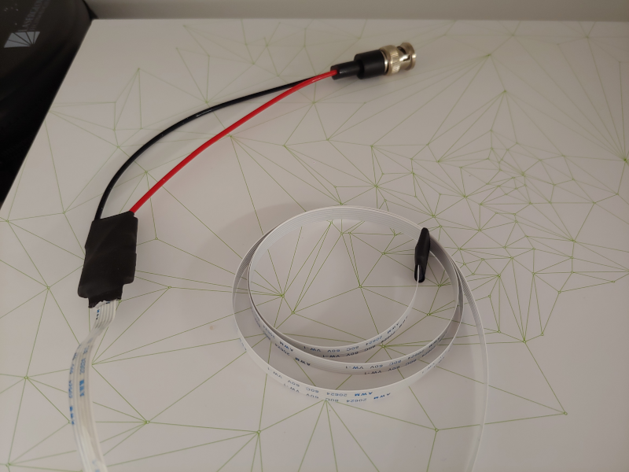

# Accelerometer sensor
Detect acceleration changes on a freely moving mouse using lightweight, readily available electronics.

## Components
- [Pro micro Atmega32U4 (3.3V) microcontroller][board] 
- [ADXL362 Triple Axis Accelerometer Breakout][sensor]
- [Flex cable (610mm)][cable]
- [BNC interface][BNC]
- [Arduino IDE][IDE]
- [ADXL362 library][library]
- [Project code][code]

## Installation
- With the help of a utility knife, cut the flex cable to keep only 6 lines and remove the blue plastic from both ends to expose the metallic wires.
- Connect pins labeled SCLK, MOSI, MISO, CS, GND, and V+ of the accelerometer board to pins 15, 16, 14, 10, GND, and VCC of the microcontroller (respectively) by soldering corresponding wires of the flex cable.
- Solder the BNC black and red cables to GND and pin 9 of the microcontroller (respectively).
- Place heat shrink around the sensor and melt a small amount of glue stick or 2-part epoxy to protect the cables from breaking. Repeat for the microcontroller.
- Install Arduino IDE and the [Arduino Addon for SparkFun boards][guide].
- Install the ADXL362 library using Arduino IDE's library manager.
- Upload the code after selecting SparkFun Pro Micro as the board and Atmega32U4 (3.3V, 8MHz) as the processor. To avoid permanently damaging the microcontroller, do not attempt to upload the code using any other combination of board and processor from the IDE.

## Version History
### 0.1.0
* 2022-05-03
  - Initial Release.
  - Version of the sensor is an adaptation from one described in a paper by [Daviu et al 2020][paper].
  - Using sensor ADXL362 instead of ADXL335.
  - Using Pro micro Atmega32U4 instead of Arduino Uno ATmega328P.
  - Using a flex cable (<0.1mm thick) instead of ribbon cables (28 AWG / 0.32mm + plastic sleave).

## License
© 2022 [Leonardo Molina][Leonardo Molina]

This project is licensed under the [GNU GPLv3 License][LICENSE.md].

[Leonardo Molina]: https://github.com/leomol
[LICENSE.md]: LICENSE.md
[paper]: https://www.nature.com/articles/s41593-020-0591-0
[board]: https://www.sparkfun.com/products/12587
[sensor]: https://www.sparkfun.com/products/11446
[cable]: https://www.digikey.ca/en/products/detail/adafruit-industries-llc/1731/6238161
[BNC]: https://www.digikey.ca/en/products/detail/mueller-electric-co/BU-5100-A-4-0/5801064
[IDE]: https://www.arduino.cc/en/Main/Software
[library]: https://github.com/annem/ADXL362
[guide]: https://learn.sparkfun.com/tutorials/pro-micro--fio-v3-hookup-guide/all
[code]: https://github.com/leomol/accelerometer/tree/master/accelerometer
