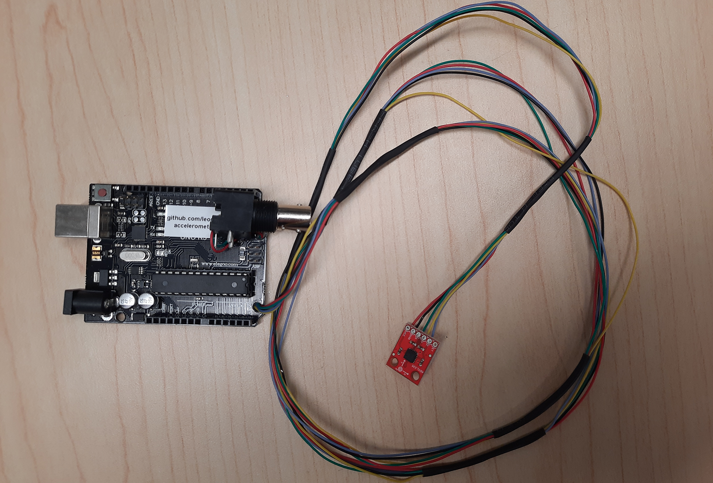
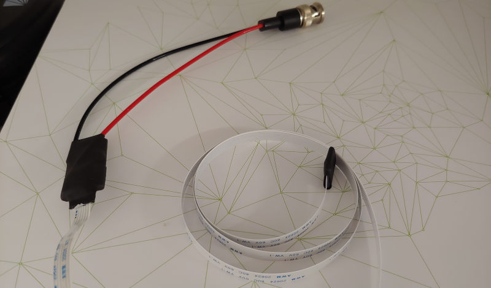

# Accelerometer sensor
Detect acceleration changes on a freely moving mouse using lightweight, readily available electronics.

Note there are two versions of the accelerometer assembly; one with an analog sensor and one with a digital sensor.

## Components for the analog sensor
- [Arduino Uno Rev3 microcontroller][uno] 
- [ADXL335 triple axis accelerometer breakout][ADXL335]
- [6x Soft cable (610mm)][soft cable]
- [BNC interface][BNC]
- [Arduino IDE][IDE]
- [Project code][analog code]

## Components for the digital sensor
- [Pro micro Atmega32U4 (3.3V) microcontroller][pro micro] 
- [ADXL362 triple axis accelerometer breakout][ADXL362]
- [Flex ribbon cable (610mm)][ribbon cable]
- [BNC interface][BNC]
- [Arduino IDE][IDE]
- [ADXL362 library][library]
- [Project code][digital code]

## Assembly instructions for the analog sensor
- With the help of a utility knife, cut 6 flex cables.
- Connect pins labeled `Z`, `Y`,  `X`, `GND`, `VCC` to pins `A2`, `A1`, `A0`, `GND`, and `3.3V` of the microcontroller.
- Connect the center pin of a BNC interface to any of the three axis (`A2`, `A1`, `A0`) and the side pin to `GND` of the microcontroller.
- Install [Arduino IDE][IDE].
- Upload the [code][analog code] after selecting `Arduino UNO` as the board.

## Assembly instructions for the digital sensor
- With the help of a utility knife, cut the flex cable to keep only 6 lines and remove the blue plastic from both ends to expose the metallic wires.
- Connect pins labeled `SCLK`, `MOSI`, `MISO`, `CS`, `GND`, and `V+` of the accelerometer board to pins `15`, `16`, `14`, `10`, `GND`, and `VCC` of the microcontroller by soldering corresponding wires of the flex cable.
- Solder the `BNC` black and red cables to `GND` and pin `9` of the microcontroller (respectively).
- Melt a small amount of glue stick or add 2-part epoxy to protect the cables from breaking. Repeat for the microcontroller.
- Place heat shrink around the sensor and the microcontroller.
- Install [Arduino IDE][IDE] and the [Arduino Addon for SparkFun boards][guide].
- Install the `ADXL362 library` using Arduino IDE's library manager.
- Upload the code after selecting `SparkFun Pro Micro` as the board and `Atmega32U4 (3.3V, 8MHz)` as the processor. To avoid permanently damaging the microcontroller, do not attempt to upload the [code][digital code] using any other combination of board and processor from the IDE.

## Usage
- Configure your data acquisition system to read analog data from one of the input ports.
- Connect the BNC cable to the analog port of the data acquisition system.
- Power the microcontroller with a usb cable.
- If using the analog sensor, you may change the sensitivity by sending a `0` over the serial port while the sensor sits still.
- Attach the accelerometer sensor to the subject.
- Use the serial port to read the processed 3-axis signal or the the BNC port to read the values from a single axis (raw values for the analog sensor; processed values from the digital sensor).

## Version History
### 0.1.0
* 2023-09-29
  - Added components, assembly instructions and code for the analog version of the accelerometer sensor.
  - Added a sensitivity calibration mechanism for the analog sensor.
* 2022-05-03
  - Initial Release.
  - Version of the sensor is an adaptation from one described in a paper by [Daviu et al 2020][paper].
  - Using sensor ADXL362 instead of ADXL335.
  - Using Pro micro Atmega32U4 instead of Arduino Uno ATmega328P.
  - Using a flex cable (<0.1mm thick) instead of ribbon cables (28 AWG / 0.32mm + plastic sleave).

## License
© 2022 [Leonardo Molina][Leonardo Molina]

This project is licensed under the [GNU GPLv3 License][LICENSE.md].

[Leonardo Molina]: https://github.com/leomol
[LICENSE.md]: LICENSE.md
[paper]: https://www.nature.com/articles/s41593-020-0591-0
[pro micro]: https://www.sparkfun.com/products/12587
[uno]: https://store.arduino.cc/products/arduino-uno-rev3
[ADXL362]: https://www.sparkfun.com/products/11446
[ADXL335]: https://www.sparkfun.com/products/9269
[ribbon cable]: https://www.digikey.ca/en/products/detail/adafruit-industries-llc/1731/6238161
[soft cable]: https://www.adafruit.com/product/2006
[BNC]: https://www.digikey.ca/en/products/detail/mueller-electric-co/BU-5100-A-4-0/5801064
[IDE]: https://www.arduino.cc/en/Main/Software
[library]: https://github.com/annem/ADXL362
[guide]: https://learn.sparkfun.com/tutorials/pro-micro--fio-v3-hookup-guide/all
[digital code]: src/digitalSensor
[analog code]: src/analogSensor
